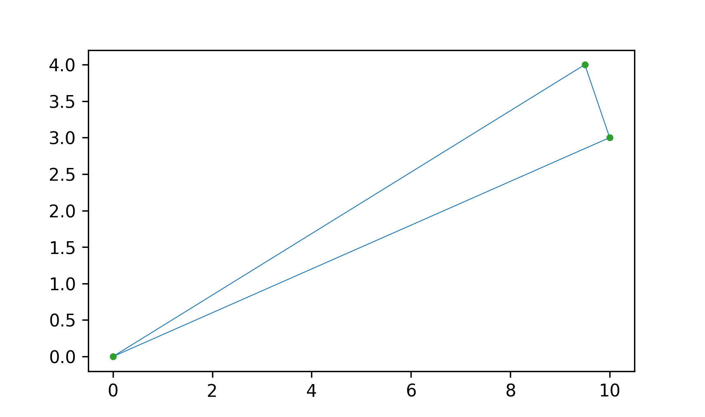
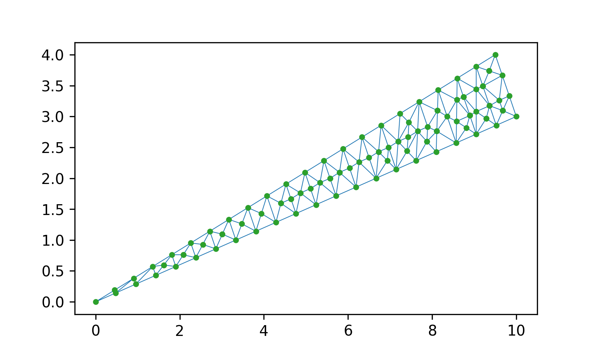
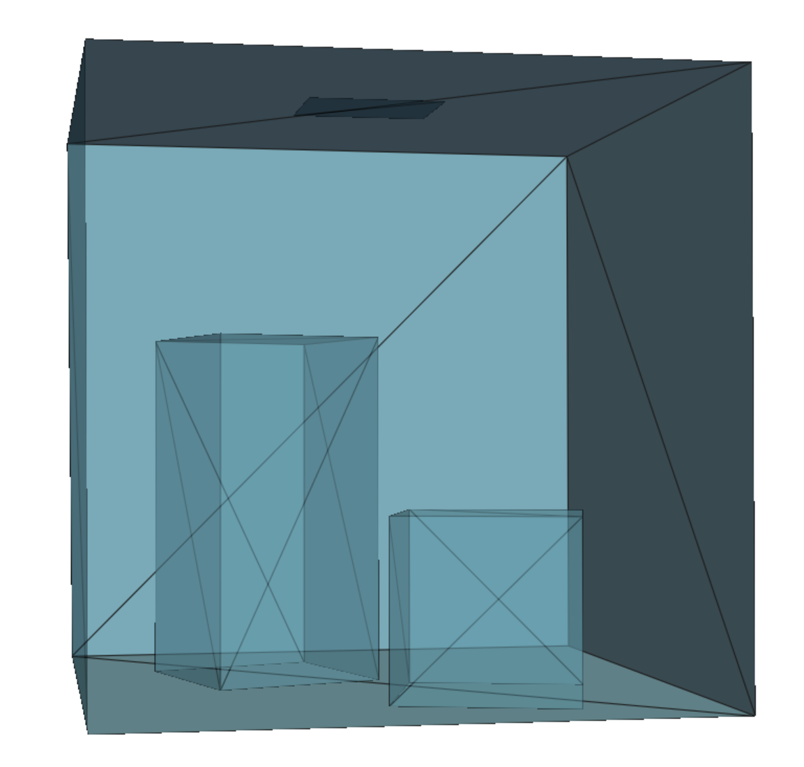
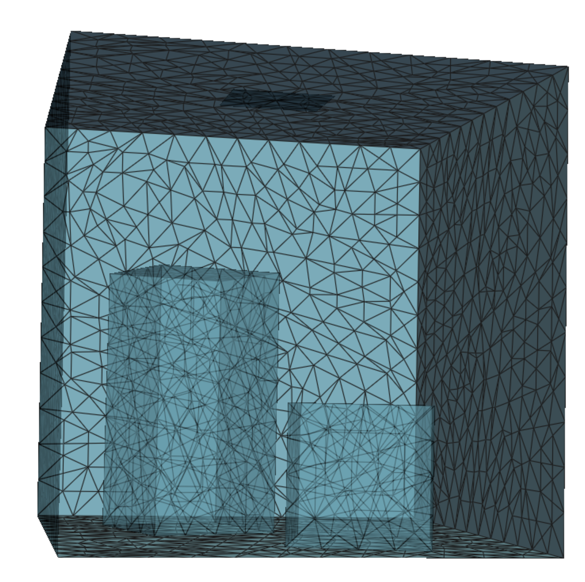
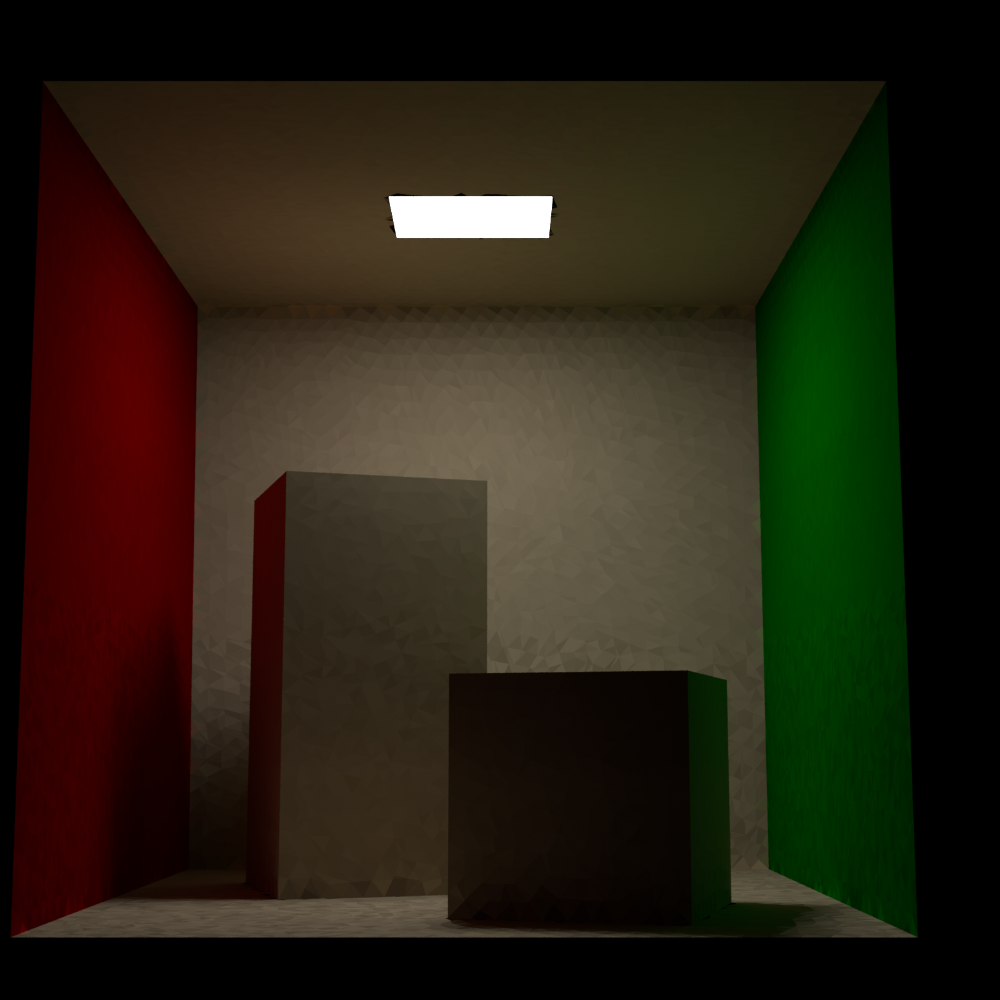
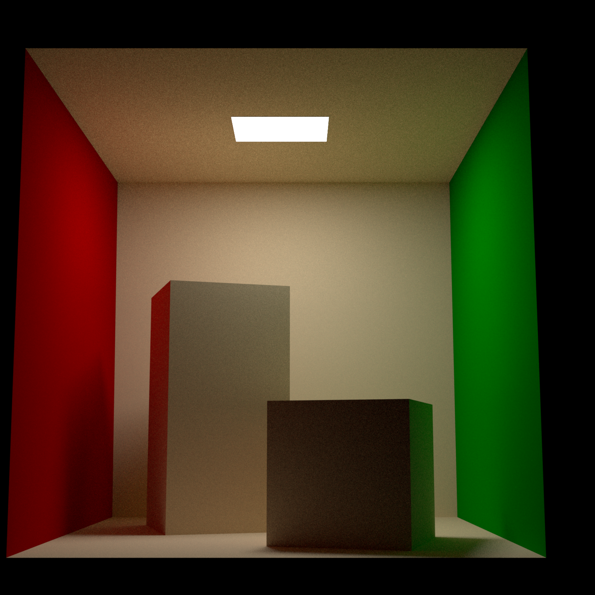
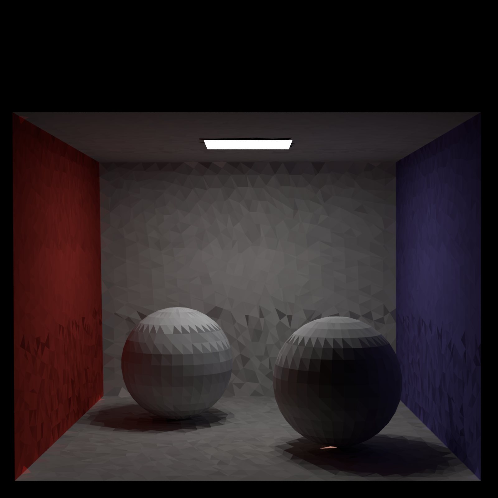
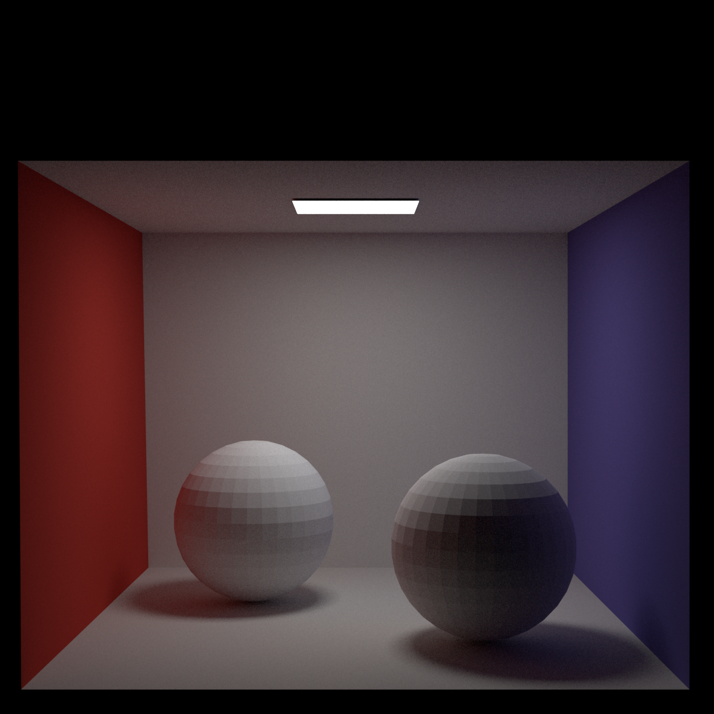
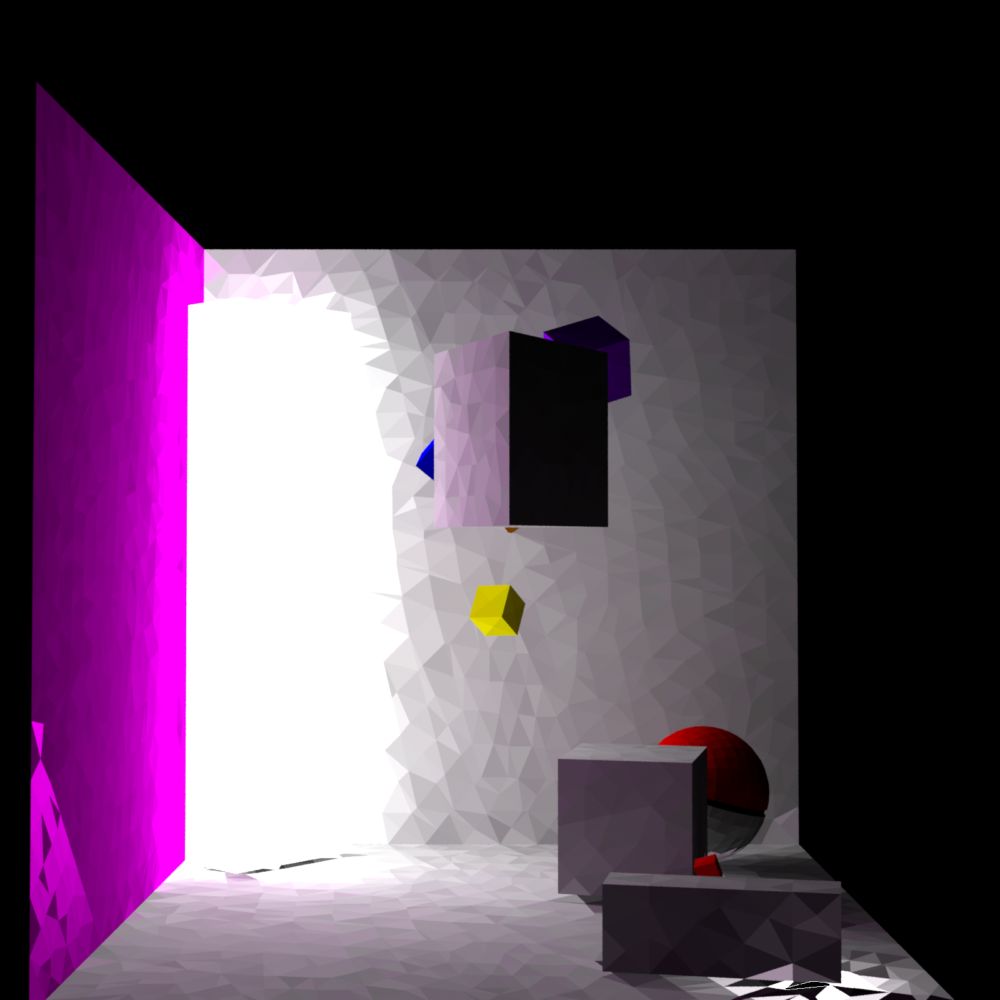
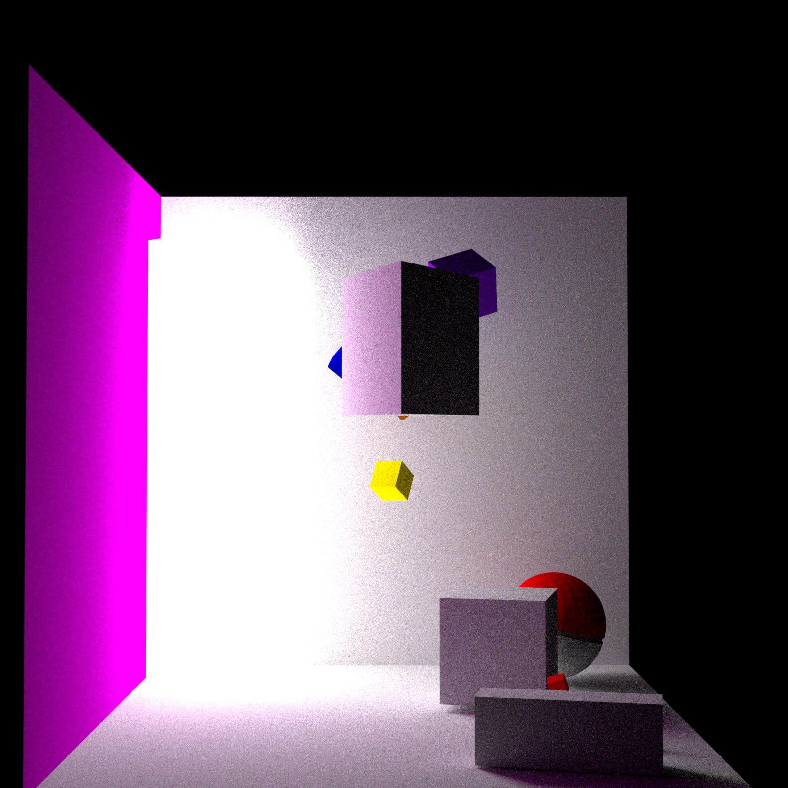

# Py-Radiosity

Trying to implement Radiosity using Mitsuba Renderer

---

# Radiosity

In 3D computer graphics, radiosity is an application of the finite element method to solving the rendering equation for scenes with surfaces that reflect light diffusely.  
The basic radiosity method has its basis in the theory of thermal radiation, since radiosity relies on computing the amount of light energy transferred among surfaces.  
In order to simplify computations, the method assumes that all scattering is perfectly diffuse.

---

## Jupyter Notebook

### **(This is currently a work in progress)**

I'm currently implementing a basic radiosity algorithm and using Mitsuba for rendering.

This is kind of a 'work around' since I am doing the following which I'll eventually improve:

- I'm saving each triangle in `.obj` file so I can load in Mitsuba (can't create triangles directly or group with each triangle with different radiance)
- After loading the triangles I am *refining* the triangles (making them smaller) based on max length of edges.

#### Triangle before and after refinement:

  
  

#### Scene before and after refinement:

  
  

- After refining each triangle, I'm making $E_i$ (Energy emitted) based on whether it was part of a light source or not.
- I'm then calculating the form factor and radiosity value for each triangle.
- *(Workaround)* I'm setting each triangle as a light source with the radiosity value as radiance.

---

### ✅ What works:

- I'm getting a decent image for simple scenes as of now.
- I'm able to load `.obj` files (not just Cornell box).

---

### ❌ What needs to be fixed/implemented:
- Adaptive patching so we don't have a lot of unnecessary triangles.
- I'm saving each triangle separately in `.obj` file due to not being able to create a triangle in Mitsuba directly (or I don't know how).  
  Hopefully I'll implement my own rendering code or fix this for Mitsuba somehow in future.
- The code for radiosity is kind of brute-force and needs to be improved.
- The `.obj` loading is janky for now — will fix that soon.
- I'm implementing in *Python* for learning now, will change this to *CUDA* once I get the time.

---

## Some Demo Renders: Radiosity (Left) and Path Tracing (Right)

### Cornell Box

  
  

---

### Cornell Box with Sphere

  
  

---

### Final Scene

  
  

