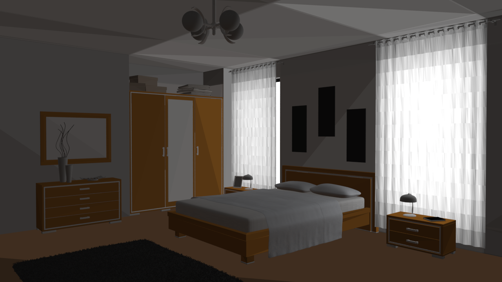
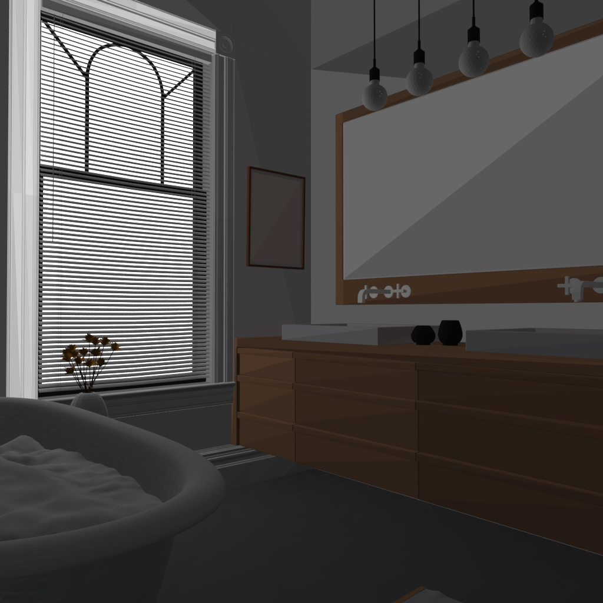
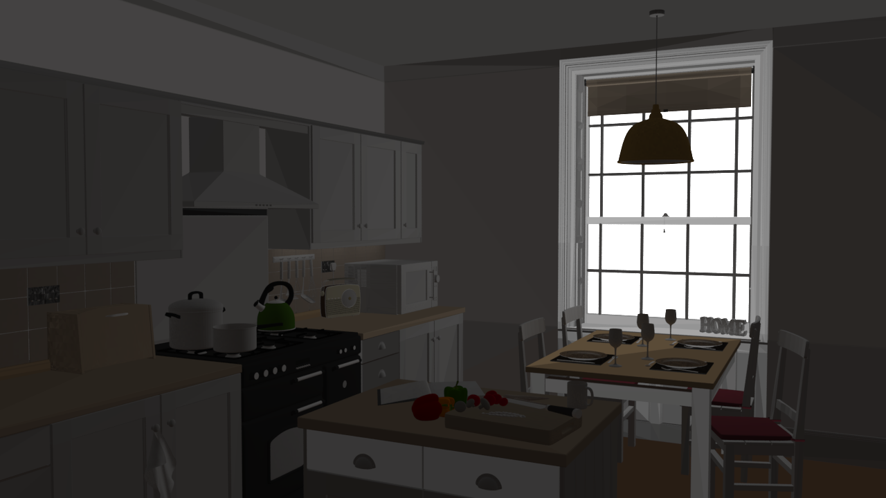
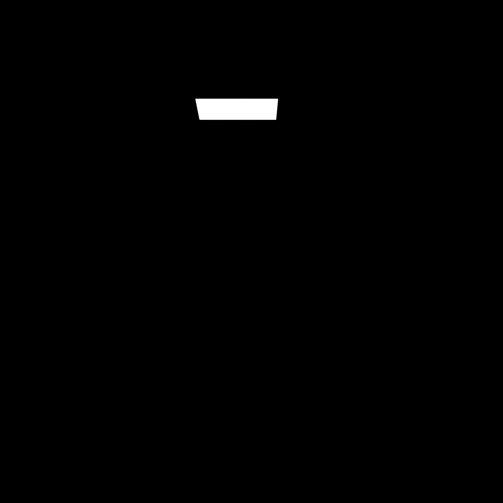
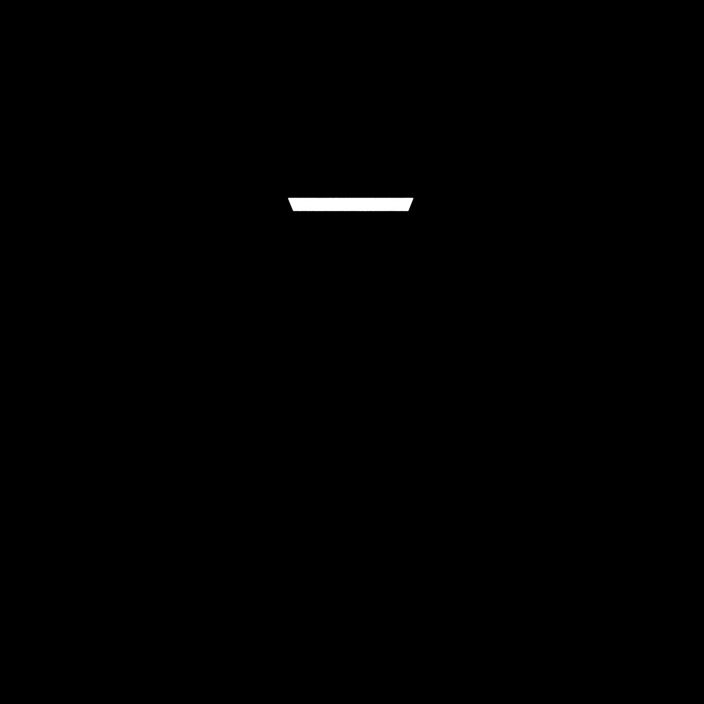

# Py-Radiosity

Trying to implement Radiosity using Mitsuba Renderer

---

# Radiosity

In 3D computer graphics, radiosity is an application of the finite element method to solving the rendering equation for scenes with surfaces that reflect light diffusely.  
The basic radiosity method has its basis in the theory of thermal radiation, since radiosity relies on computing the amount of light energy transferred among surfaces.  
In order to simplify computations, the method assumes that all scattering is perfectly diffuse.

---

## Jupyter Notebook

### **(This is currently a work in progress)**

I'm currently implementing a basic radiosity algorithm and using Mitsuba for rendering.

This is kind of a 'work around' since I am doing the following which I'll eventually improve:

- Loading hte mitsuba scenes and saving the classes like **Rectangle** and **Cube** as ```obj``` files so I can load them as **Mesh** class and use ```use_attribute```
- Once loaded, I extract all the necessary information of the geometry to calculate the radiosity (vertices, normals, reflectivity, emission)
- After that I am adding a ```face_radiosity``` attribute to each triangle and putting the value of calculated radiosity in that

### Refinedment has beed removed for raw mitsuba scene but can be done for ply files as given in older version
#### Triangle before and after refinement (Worked in older version Removed in new one):
<p float="left">
  
  
</p>

#### Scene before and after refinement:
<p float="left">
  
  
</p>

- After refining each triangle, I'm making $E_i$ (Energy emitted) based on whether it was part of a light source or not.
- I'm then calculating the form factor and radiosity value for each triangle.

---

### ✅ What works:

- I'm getting a decent image for simple scenes as of now.
- Some of the components have been vectorized
- A barebones visualization of triangles is provided
- I am able to extract color from texture for albedo

---

### ❌ What needs to be fixed/implemented:
- Adaptive patching so we don't have a lot of unnecessary triangles.
- The code for radiosity and needs to be improved.
- Some class of mesh/primitives are not laoded properly
- I'm implementing in *Python* for learning now, will change this to *CUDA* once I get the time.

---

## Some Demo Renders: Radiosity (Left) and Path Tracing (Right)

### Bedroom
<p>
  
</p>

### Bathroom
<p>
  
</p>

### Kitchen
<p>
  
</p>

### Cornell Box \[Older version\]

<p>
  
</p>

---

### Cornell Box with Sphere

<p float="left">
  
  
</p>

---

### Final Scene

<p float="left">
  
  
</p>

## GIF of passes (Left: Constant, Right:Interpolated) [Outdated! Will update soon]

<p float="left">
  
  
</p>

<p float="left">
  
  
</p>

